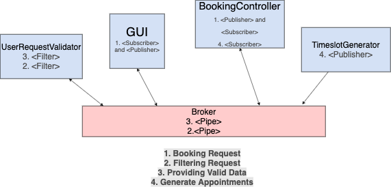
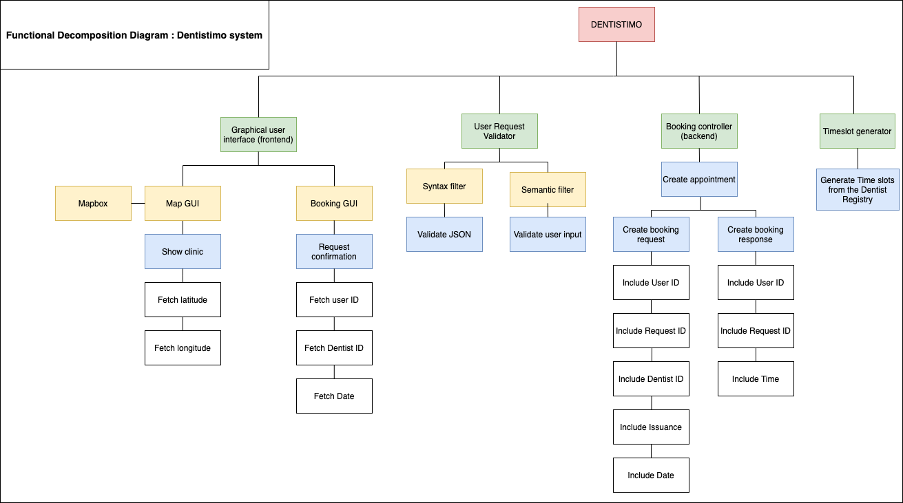

# ***Dentistimo project* - DIT355 Mini Project: Distributed Systems**
## Purpose
### The task

The aim of this project is to create four independent components, which together demonstrates a distributed system.  
The scope of the system is a service where clients can book dentist appointments through a web application.  
The project should be built using agile practices, allowing requirements to change over time, with the team being able to adapt their way of working. 

The four components, or systems, are split up into individual directories. Those include:

1. **Graphical User Interface (including a *Map* GUI and *Booking* GUI)**   
   This is the component which allows the user to interact with the system.

2. **User Request Validator (including a syntax and semantic filter)**  
   The aim of this component is to validate the data that the user sends through the Booking GUI to the Booking Controller and also validate the schemas. The schemas that will be validated here are the User schema, Clinic schema and Appointment schema.
It will also filter the booking requests that the users send. For example, if a user sends a booking request with empty/null values through the Booking GUI, it will not process to the Booking Controller. Another example would be if two user sends a booking request for the same time slot, it will process the request according to some priority (will be decided later) and then send it to the Booking Controller.   
3. **Booking Controller   **
   The aim of this component is to book the appointments and save them in the MongoDB. 

4.  **Timeslot Generator ** 
   This component fetches the dentists registry and generate time-slots for the clinics. 

### The Team

- Shahrzad Sheikholeslami 
- Douglas Johansson
- Mary Olsson Radda
- Ariana Mededovic
- Samar Saeed
- Effat Enti

### Resources
- [_Dentists Registry_](https://raw.githubusercontent.com/feldob/dit355_2020/master/dentists.json)

## Software Requirement Specification (SRS)
### Requirements

**1.** The system shall provide a graphical user interface with a map of affiliated dentists for the patient.

  * 1.1 The system shall distinguish between the available and unavailable dentists on the map. 

**2.** The system shall display all the available clinics for the chosen day. 

  * 2.1 The system shall allow the clients to pick a time slot for their appointment. 

**3.** The system shall allow patients to book an appointment for an available dentist.

  * 3.1 The system shall confirm or reject the patient’s desired time.

  * 3.2 The system shall allow one active reservation per patient.

  * 3.3 The system shall allow patients to cancel a reservation if it is not less than 24 hours before the booked time.

**4.** The system shall create appointments of 30 minutes for every half and full hour of the opening hours. 

**5.** The system shall allow dentists a total of 1,5 hour break time per day, split into 60 minutes lunch break and 30 minutes fika break.

**6.** The system shall send a response with the time of the appointment to the patient.

**7.** The system shall be aware of changes made to the dentist registry, and update the GUI accordingly. 

**8.** The system shall allow appointments of new clinics to be booked.

**9.** The system shall allow a clinic to have multiple dentists.

**10.** The system shall allow a request generator to publish requests through the MQTT broker.

## Software Architecture Document (SAD)

### Technologies

* Vuejs -- For web client frontend

* Nodejs -- For web client backend

* Mqtt.js -- Client library for broker

* EMQ  -- Broker for the MQTT protocol 

* Mapbox -- Integrated map compatible with Vue

### Architectural Diagram

### Functional Decomposition Diagram
A green box indicates a **component.**\
A yellow box indicates a **subcomponent.**\
A blue box indicates a **functionality.**\
A white box indicates a **task.**

## Program Management Report (PMR)

### **Practices**
